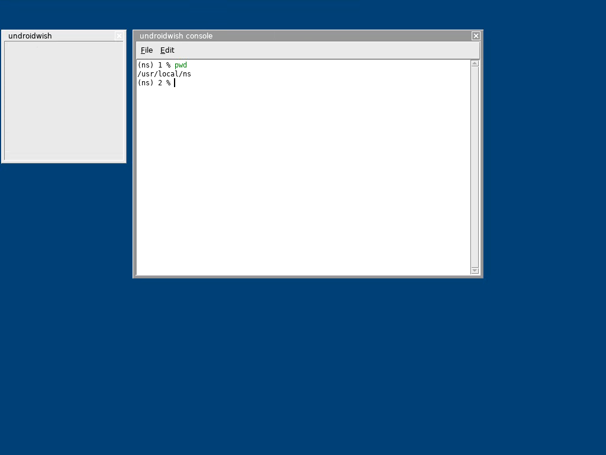

# WebWish

**Serve any SDL2 / Tk desktop app as a web app — with zero changes to the app.**



*The undroidwish framebuffer above is a real capture straight from the browser
`<canvas>` — a live `pwd` typed into the web page and executed by the headless
Tcl/Tk process on the server.*

WebWish is an [SDL2](https://libsdl.org) video driver (internally named
`wstiles`) that runs a graphical app **headless on a server** and renders +
controls it in a **web browser**. The app's framebuffer is streamed to an
HTML `<canvas>` over a WebSocket; the viewer's mouse and keyboard travel back
the same way. The app itself is unmodified and unaware — to it, `wstiles` is
just another SDL video backend.

It grew out of running [**undroidwish**](https://www.androwish.org/) (AndroWish's
Tcl/Tk-on-SDL runtime) in a browser, but the driver works for any SDL2 program
that renders through SDL's software framebuffer path.

```
   ┌────────────┐   framebuffer   ┌──────────────┐    WebSocket    ┌──────────┐
   │ SDL2 / Tk  │ ───tiles/AV1──► │  wstiles SDL │ ──────────────► │ browser  │
   │    app     │ ◄──mouse/keys── │    driver    │ ◄────────────── │ <canvas> │
   └────────────┘                 └──────────────┘                 └──────────┘
        runs headless, server-side                                  the only UI
```

> **Status: working alpha.** Display, mouse, keyboard (including control keys),
> multi-command round-trips, per-session process spawn/reap, and single-port
> multiplexing are all verified live on arm64 macOS. The driver is also
> **verified to build and initialize on Linux** (against AndroWish's SDL2 fork,
> in a Debian container) — see [docker/](docker/). It is a **patch into an SDL2
> build tree**, not yet a drop-in library. See [Limitations](#limitations).

> ## ⚠️ Security
>
> Exposing a GUI app — especially undroidwish's default **Tcl console** — to
> untrusted users is **remote code execution as a service**. Do **not** put
> WebWish in front of anyone you don't trust without reading
> **[SECURITY.md](SECURITY.md)** first. The short version: (1) never expose a
> console — ship a locked-down app in a **safe interpreter**; (2) run each
> session in a **hardened, ephemeral container** (`docker/`); (3) authenticate
> and rate-limit the bridge; (4) never run it on a host that holds anything you
> care about.

---

## How it works

- The driver advertises a software framebuffer in `SDL_PIXELFORMAT_ABGR8888` —
  whose little-endian byte order is exactly `R,G,B,A`, i.e. directly what the
  browser's `putImageData` wants, zero conversion.
- Every frame it diffs the framebuffer against a shadow copy on a **64×64 tile
  grid** and sends only the changed tiles, each **zlib-deflated** (lossless;
  a flat UI's first paint drops from ~3 MB to ~19 KB, ~160×).
- Optionally (`SDL_VIDEO_WSTILES_CODEC=av1`) it hands the whole changed frame
  to a realtime **AV1** encoder (libaom, `tune=screen`) with a live quality
  knob; the browser decodes it with **WebCodecs**. Tiles win on flat UI, AV1
  wins on photographic/animated content.
- Three transports, selectable by environment variable:
  1. **Built-in server** — the driver runs its own libwebsockets server.
  2. **stdio framing** — length-prefixed frames on stdin/stdout, so a proxy can
     bridge it (used by the naviserver reference server).
  3. **oneshot** — self-terminates when its one client disconnects (per-session
     model).

The full byte layout is in [docs/WIRE-PROTOCOL.md](docs/WIRE-PROTOCOL.md).

---

## Quick start

You first need to build SDL2 with this driver and link your SDL2 app against
it — see [docs/BUILDING.md](docs/BUILDING.md). Once you have a binary
(`undroidwish-wstiles` in the examples below):

### Mode A — the driver's own web server (simplest)

```sh
SDL_VIDEODRIVER=wstiles SDL_VIDEO_WSTILES_PORT=8090 \
    ./undroidwish-wstiles yourapp.tcl
# then open http://localhost:8090/
```

### Mode B — many users on one port, behind naviserver

The `server/` directory is a [NaviServer](https://naviserver.sourceforge.io/)
reference bridge. Each browser tab gets its **own** private app process, spawned
on connect and killed on disconnect, all multiplexed through **one** public
port. Copy `server/*` into your naviserver pageroot (e.g. `/uw/`), set the
binary path at the top of `stream.adp`/`spawn.adp`, and open
`http://host/uw/demob.adp`.

- `stream.adp` + `demob.adp` — single public port; WebSocket ⇄ stdio bridge,
  event-driven and off the connection-thread pool (scales to many clients).
- `spawn.adp` + `demo.adp` — simpler alternative: each tab gets its own TCP
  port via the driver's built-in server.

---

## Environment variables

| Variable | Effect |
|---|---|
| `SDL_VIDEODRIVER=wstiles` | select this driver |
| `SDL_VIDEO_WSTILES_PORT=<n>` | built-in server listen port (Mode A) |
| `SDL_VIDEO_WSTILES_STDIO=1` | speak length-prefixed frames on stdin/stdout instead |
| `SDL_VIDEO_WSTILES_CODEC=av1` | whole-screen AV1 instead of lossless tiles |
| `SDL_VIDEO_WSTILES_CQ=<12..63>` | AV1 constant-quality level (lower = sharper/bigger) |
| `SDL_VIDEO_WSTILES_ONESHOT=1` | exit when the last client disconnects |

---

### Mode C — one hardened container per session (recommended for untrusted use)

The `docker/` directory runs each session as a locked-down, ephemeral container
(`--network none`, read-only rootfs, non-root, `--cap-drop ALL`, pid/mem/cpu
caps), wired over stdio so no per-session port is opened. `server/stream-docker.adp`
is the bridge variant that spawns a container instead of a bare process. See
[docker/README.md](docker/README.md) and [SECURITY.md](SECURITY.md).

---

## Repository layout

```
driver/    SDL_wstiles.c — the SDL2 video driver (the reusable core)
           data/{index.html,wstiles.js} — client assets embedded into the binary
           genfiles.sh — regenerates SDL_wstiles_files.h from data/
server/    NaviServer reference bridge (.adp) + a copy of the browser client
           stream-docker.adp — bridge variant: one hardened container per session
docker/    Linux build recipe + hardened per-session container runtime
patches/   the edits needed to wire the driver into an SDL2 tree
docs/      BUILDING.md, WIRE-PROTOCOL.md
SECURITY.md  threat model + defense-in-depth — READ BEFORE EXPOSING
```

> `server/wstiles.js` and `driver/data/wstiles.js` are the **same** browser
> client; keep them in sync.

---

## Dependencies

- **libwebsockets** (built-in server / stdio framing)
- **zlib** (tile compression)
- **libaom** (only if compiled with `-DWSTILES_HAVE_AV1` for the AV1 codec)
- A browser with `DecompressionStream` (tiles) and, for AV1, **WebCodecs**.

---

## Limitations

This is an honest alpha. Not yet done:

- Built and verified **only on arm64 macOS**. The driver is written against
  SDL2's internal video API and is not macOS-specific, but Linux/Windows/x86
  builds are untried.
- It's a **patch into an SDL2 build**, not a standalone shared library.
- `server/spawn.adp` is **unauthenticated** — a DoS vector; add rate-limiting
  and a session cap before any public deployment.
- Per-session ports (Mode B's `spawn.adp` variant) must be browser-reachable;
  the `stream.adp` single-port bridge avoids this.
- No shared multi-viewer stream yet (each viewer drives its own process).

---

## Credits & license

WebWish is released under the **zlib license** (see [LICENSE](LICENSE)), the
same as SDL. `driver/SDL_wstiles.c` is derived from SDL's `SDL_jsmpeg.c`.
Built for use with [undroidwish / AndroWish](https://www.androwish.org/) by
Christian Werner. Linked libraries (libwebsockets, zlib, libaom) carry their
own licenses.
